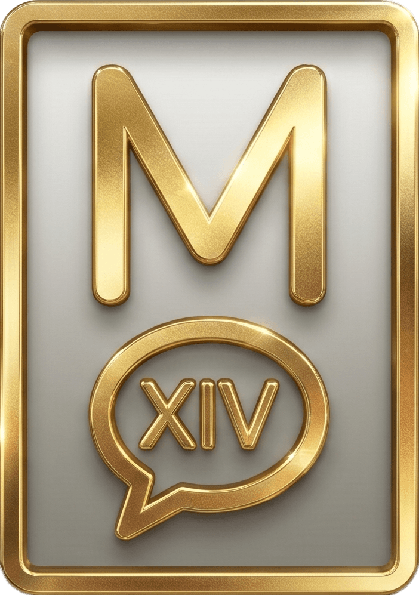

<p align="center">
  
</p>

<h1 align="center">XIV Chat Macro</h1>

<p align="center">
  A fan-made generator for FFXIV chat macros that align pixel-perfectly in-game.
</p>

<p align="center">
  <a href="https://xiv-chat-macro.parafeu.dev"><b>→ Open the app</b></a>
</p>

---

## What it does

FFXIV chat uses a proportional font (AXIS), so ASCII art like alert boxes
rarely lines up when you type them with spaces in a regular editor. This
tool computes padding based on the actual glyph widths of the in-game font
so your boxes render straight.

It currently ships a single generator — **Alert box** — with:

- Multi-line text input, left/center/right alignment
- Adjustable extra width and height
- 12 kaomoji decorations (`\(´･ω･｀)ﾉ`, `\(＾ω＾)ﾉ`, `\(ToT)ﾉ`, …) with
  arms that follow the box's ∩ caps
- Live preview of the macro rendered over a chat backdrop
- One-click copy to clipboard

The algorithm handles the parity constraints of AXIS_12 (12-unit cells,
3-unit spaces, GCD = 3) and flags any structural misalignment (≤ ⅓ of a
space) it can't eliminate.

## Installation

```bash
git clone <repo-url> xiv-chat-macro
cd xiv-chat-macro
npm install
```

Two additional files are required and **must be provided locally** — they
are gitignored because they contain Square Enix assets:

### 1. Font widths table

`app/constants/ff14FontWidths.json` — generated from your local FF14 install
using the extraction script (see below).

### 2. Chat backdrop (optional)

`public/chat-preview-bg.png` — any in-game chat screenshot. Used as the
preview's backdrop. Without it, a neutral fallback is rendered.

Point the `NUXT_PUBLIC_CHAT_PREVIEW_BG` env variable at the image path. See
`.env.example` for details.

## Usage

### Development

```bash
npm run dev
```

Open <http://localhost:3000> and pick a generator from the sidebar. The
preview and macro update live as you type.

### Production build

```bash
npm run build     # SSR build
npm run generate  # static site (GitHub Pages, Netlify, …)
npm run preview   # serve the production build locally
```

### Generating a macro

1. Pick a generator (currently: **Alert box**)
2. Type the message; use newlines for multi-line boxes
3. Pick a decoration (plain border or one of 12 kaomojis)
4. Adjust alignment, extra width, extra height as desired
5. Click **Copy macro**
6. Paste into any FFXIV chat input or macro slot

## Font widths extraction

The macro alignment depends on the exact pixel widths of each glyph in
AXIS_12 (the default FFXIV chat font). Those widths are computed by
`scripts/extract-font-widths.py`, which:

1. Opens your local FF14 sqpack archive (default path:
   `~/.xlcore/ffxiv/game/sqpack/ffxiv`)
2. Hashes the virtual path `common/font/AXIS_12.fdt` (CRC32 variant used by
   SqPack) to look it up in `000000.win32.index2`
3. Reads the matching file from the `.dat` archive and decompresses the zlib
   blocks
4. Parses the FDT (Font Data Table) binary: 32-byte header + 16-byte glyph
   records (codepoint, bitmap width, left-side bearing, …)
5. Computes each glyph's advance as `width + xOffset` and writes the result
   to `app/constants/ff14FontWidths.json`

Run it once after cloning:

```bash
python3 scripts/extract-font-widths.py
```

Flags:

```bash
--font AXIS_14             # default is AXIS_12 (match FFXIV chat default)
--sqpack /path/to/sqpack   # default ~/.xlcore/ffxiv/game/sqpack/ffxiv
--out path/to/output.json  # default app/constants/ff14FontWidths.json
```

Requires Python 3.10+ (no third-party deps — only stdlib `zlib`, `struct`,
`json`, `pathlib`).

## Tech stack

- [Nuxt 4](https://nuxt.com) + Vue 3 Composition API
- [@nuxt/ui](https://ui.nuxt.com) v4 + Tailwind CSS v4
- [Pinia](https://pinia.vuejs.org) (+ persisted state for identity settings)
- [@nuxtjs/i18n](https://i18n.nuxtjs.org) for EN/FR
- TypeScript throughout

## Legal

This is a fan project. It is **not** affiliated with, endorsed by, or
sponsored by Square Enix.

FINAL FANTASY is a registered trademark of Square Enix Holdings Co., Ltd.
All FFXIV game assets (fonts, screenshots, chat colour palette) remain the
property of Square Enix. Those assets must be extracted from the user's own
legally purchased install; they are explicitly excluded from this repository
(see `.gitignore`).

## License

MIT for the source code in this repository.

The FFXIV assets this project interacts with are subject to Square Enix's
terms and are not covered by the MIT license.
